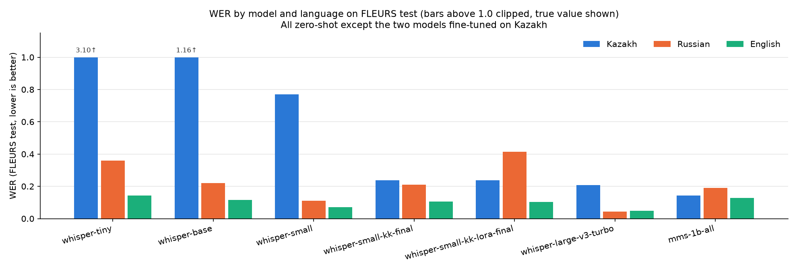
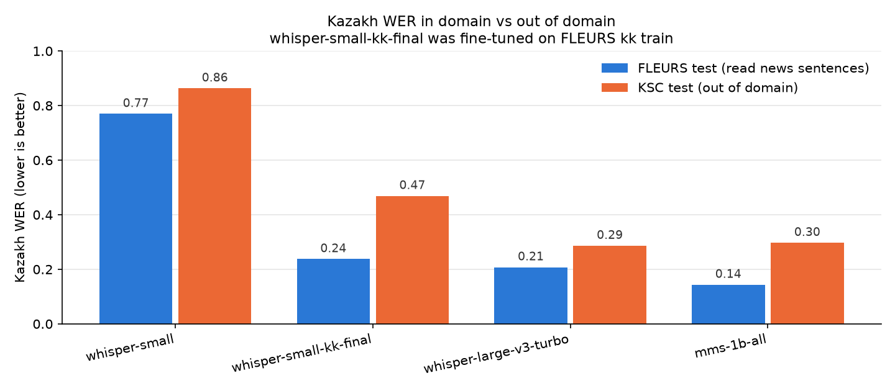
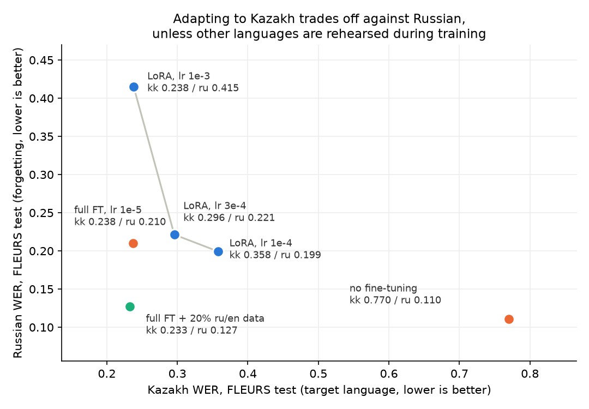

# Multilingual ASR pilot: Kazakh vs Russian vs English

Pilot for the TU Wien CVL master's topic "Multilingual Speech Recognition for Low-Resource Languages".
Question: how well do off-the-shelf multilingual ASR models transcribe Kazakh (low-resource)
compared with Russian and English, and what does it cost to run them locally?

## Summary

Eleven phases on one laptop (RTX 5060 Laptop, 8 GB VRAM): a zero-shot baseline on FLEURS, CPU inference with int8
quantization, Kazakh fine-tuning of whisper-small, an out-of-domain check on the Kazakh Speech Corpus, the fine-tuned
model under int8, LoRA against full fine-tuning, a LoRA learning-rate sweep, confidence intervals, an error
analysis, and multilingual rehearsal.
Every number below comes from a full test set with identical normalization; per-utterance outputs are in `results/`,
and every run carries a 95% bootstrap confidence interval (phase 9 lists which differences are statistically real).

| model | params | Kazakh WER, FLEURS test | Kazakh WER, KSC test (out of domain) |
|---|---|---|---|
| whisper-tiny | 38 M | 3.104 (unusable) | — |
| whisper-base | 73 M | 1.157 (unusable) | — |
| whisper-small | 242 M | 0.770 | 0.863 |
| **whisper-small fine-tuned on 11.8 h Kazakh** | 242 M | **0.238** (−69% rel.) | 0.469 (−46% rel.) |
| whisper-small, same data, LoRA r=32 | 3.5 M trained | 0.238 | 0.483 |
| **whisper-small, fine-tuned + 20% ru/en rehearsal** | 242 M | **0.233** | not measured |
| whisper-large-v3-turbo | 809 M | 0.208 | **0.286** |
| mms-1b-all | 965 M | **0.144** | 0.297 |

For reference, Russian and English WER of zero-shot whisper-small on FLEURS: 0.110 and 0.071.

1. **Model size decides whether Kazakh works at all.** Below whisper-small the models do not transcribe Kazakh, they
   hallucinate: 60% of whisper-tiny's Kazakh outputs are repetition loops, which is why its WER exceeds 1. The same
   models handle Russian and English (WER 0.07–0.36), so the failure is about the language, not the model family.
2. **11.8 h of Kazakh fine-tuning beats 3.3× more parameters in domain.** Fine-tuned whisper-small (242 M) reaches
   0.238 against zero-shot large-v3-turbo's 0.208 (809 M), on a laptop, in 70 minutes of training.
3. **In-domain numbers overstate the gain by a third.** On KSC the same fine-tuning gives −46% instead of −69%, and the
   zero-shot large model wins again (0.286 vs 0.469). Kazakh was learned, general robustness was not.
4. **MMS's apparent Kazakh lead is largely in-domain.** Best on FLEURS (0.144), it drops to 0.297 on KSC, level with
   turbo; its training data includes FLEURS train.
5. **Adapting to Kazakh trades off against Russian — but the trade-off can be avoided.** Across a LoRA
   learning-rate sweep, Kazakh improves monotonically (0.358 → 0.296 → 0.238) as Russian degrades
   (0.199 → 0.221 → 0.415), so the exchange rate is set by the size of the update, not by the tuning method.
   Mixing 20% Russian and English data into the fine-tuning set removes ~80% of the forgetting at no cost to Kazakh
   (kk 0.233, ru 0.127 against a 0.110 baseline). English is far less affected than Russian throughout —
   interference tracks language similarity.
6. **Local CPU inference is practical and int8 is nearly free.** int8 costs at most +0.4 WER points while running
   2.1–2.9× faster and taking 252 MB instead of 971 MB; one hour of speech costs 6–12 minutes of CPU time. The
   fine-tuned Kazakh model keeps its accuracy through quantization (0.235 int8 on CPU vs 0.238 fp16 on GPU).

Measurement pitfalls that changed results, all documented in the phase sections: Whisper silently truncates audio
over 30 s; Whisper's `BasicTextNormalizer` deletes text in brackets (11% of FLEURS references); FLEURS Russian mixes
`ё`/`е`; RTF measured on 50 utterances underestimated the full-set value by 60%; fine-tuning on short clips damaged
long-form decoding; and number formatting (digits vs words) moves WER by 1–4 points on KSC.

## Setup

| | |
|---|---|
| Hardware | Laptop, NVIDIA RTX 5060 Laptop GPU (8 GB, Blackwell sm_120), AMD Ryzen 7 260 (8 cores / 16 threads), 14 GB RAM |
| Software | Ubuntu 26.04, Python 3.12.14, torch 2.11.0+cu128, transformers 5.17.0, datasets 5.0.1, jiwer 4.0.0 (full pins in `requirements.txt`, environment in `results/env.json`) |
| Data | FLEURS (`google/fleurs`, parquet), full **test** splits: kk_kz 856 utt. / 3.83 h, ru_ru 775 / 2.50 h, en_us 647 / 1.77 h |
| References | `raw_transcription` field, normalized with the same function as hypotheses |
| Decoding | Language forced (no language ID). Whisper: greedy (`num_beams=1`), fp16. MMS: CTC greedy, fp16, language adapter kaz/rus/eng |
| Metrics | Corpus-level WER and CER (jiwer: total edits / total reference words or characters); RTF = decoding wall time / audio duration (excl. data loading and one untimed warm-up); peak VRAM = `torch.cuda.max_memory_allocated` |

**Normalization** (`common.normalize`, identical for references and hypotheses in every phase):
NFKC → lowercase → `ё`→`е` → every Unicode punctuation/symbol character (categories P\*, S\*) replaced by a space → whitespace collapsed.
Kazakh letters (ә ғ қ ң ө ұ ү һ і) and diacritics are kept. Two deliberate deviations from Whisper's `BasicTextNormalizer`:

- It deletes text in brackets. 10–12% of FLEURS test references contain spoken words in parentheses
  (e.g. "(dividing by twelve to obtain the simplest whole-number ratio)"), so it would remove those words from the evaluation.
- `ё`→`е`: FLEURS Russian references use both spellings inconsistently. Without the mapping Russian WER is 0.6–1.0 points higher for every model (e.g. large-v3-turbo 0.054 vs 0.044).

**Utterances longer than 30 s** (14 in kk, 1 in ru, 0 in en) are decoded with Whisper's sequential long-form mode, one at a time. The default feature extractor silently truncates them to 30 s. MMS (CTC) takes audio of any length.

## Phase 1: zero-shot baseline (GPU)

| model | WER kk | WER ru | WER en | CER kk | CER ru | CER en |
|---|---|---|---|---|---|---|
| whisper-tiny | 3.104 | 0.359 | 0.144 | 1.692 | 0.108 | 0.064 |
| whisper-base | 1.157 | 0.220 | 0.115 | 0.510 | 0.058 | 0.056 |
| whisper-small | 0.770 | 0.110 | 0.071 | 0.259 | 0.030 | 0.032 |
| whisper-large-v3-turbo | 0.208 | 0.044 | 0.049 | 0.073 | 0.013 | 0.021 |
| mms-1b-all | **0.144** | 0.189 | 0.128 | **0.030** | 0.039 | 0.046 |

| model | params (M) | RTF kk | RTF ru | RTF en | peak VRAM alloc (GB) | batch |
|---|---|---|---|---|---|---|
| whisper-tiny | 38 | 0.0058 | 0.0017 | 0.0014 | 0.33 | 16 |
| whisper-base | 73 | 0.0053 | 0.0020 | 0.0021 | 0.59 | 16 |
| whisper-small | 242 | 0.0089 | 0.0042 | 0.0040 | 1.74 | 16 |
| whisper-large-v3-turbo | 809 | 0.0096 | 0.0107 | 0.0120 | 2.39 | 16 |
| mms-1b-all | 965 | 0.0057 | 0.0053 | 0.0052 | 4.23 | 4 |

Share of "runaway" hypotheses (normalized hypothesis more than 1.5× the reference length, i.e. repetition loops or hallucinations):

| model | kk | ru | en |
|---|---|---|---|
| whisper-tiny | 60.2% | 0.3% | 0.0% |
| whisper-base | 7.5% | 0.0% | 0.2% |
| whisper-small | 2.5% | 0.0% | 0.0% |
| whisper-large-v3-turbo | 0.7% | 0.0% | 0.0% |
| mms-1b-all | 0.0% | 0.0% | 0.0% |

Per-utterance references and hypotheses (raw and normalized) are in `results/phase1/<model>__<lang>.csv`, run metadata in the matching `.json`.
The 50-utterance smoke test (first 50 test utterances per language, same code) is in `results/phase1_smoke/`.

### Findings (phase 1)

1. **Small Whisper models do not work for Kazakh.** WER > 1 for tiny and base means more errors than reference words. 60% of whisper-tiny's Kazakh outputs are repetition loops. For Russian and English the same models are usable (WER 0.07–0.36), so the gap is language-specific, not model-specific.
2. **The Kazakh gap narrows sharply with scale.** Kazakh WER drops 3.10 → 1.16 → 0.77 → 0.21 from tiny to large-v3-turbo. The ratio to Russian WER stays large (whisper-small 7×, turbo 4.7×).
3. **MMS-1b-all is the best Kazakh model (WER 0.144, CER 0.030)** but the worst of the larger models on Russian and English. Caveat: MMS-1b-all was fine-tuned on data that includes the FLEURS *train* split (per its model card), so on FLEURS it is in-domain. The test sentences themselves were not in its training data, but its advantage here may not transfer to other Kazakh domains.
4. **Kazakh CER is much lower than WER** for all usable models (turbo 0.073 vs 0.208). Many word errors are therefore partial: only a few characters are wrong inside long agglutinative words, yet WER counts the whole word as an error.
5. **GPU inference is not the bottleneck.** All models run 80–700× faster than real time on the laptop GPU and use at most 4.2 GB VRAM.

### Limitations (phase 1)

- **Numbers are not normalized.** 19–20% of references contain digits. Whisper often writes Kazakh numbers as words ("10 мың" vs "10 000"), and MMS writes no digits in English. On utterances without digits, WER is 0.4–3 points lower. For example, turbo kk: 0.208 overall vs 0.180 without digits, and MMS en: 0.128 vs 0.110.
- Latin-script names in Russian references (e.g. "civilis") are sometimes transliterated to Cyrillic by the models and counted as errors.
- Greedy decoding only. Beam search and temperature fallback would likely reduce Whisper's repetition loops, but they were not evaluated.
- RTF depends on batch size (16 for Whisper, 4 for MMS to stay within 8 GB), padding and long-form decoding. Kazakh RTF for small Whisper models is higher mainly because of repetition loops and the 14 long-form utterances. RTFs are indicative, from a single run.
- One run per configuration, no confidence intervals.

### Issues found during phase 1 (and fixed)

- The first smoke run truncated the 33.8 s Russian utterance to 30 s. whisper-large-v3-turbo then produced a repetition loop on it, and its smoke Russian WER was 0.163 instead of 0.054 (both before the ё→е mapping). Fixed with long-form decoding before the full run. After the fix, that utterance is transcribed exactly.
- `results/phase1/whisper-base__ru.csv` was truncated when an in-place rescoring run was interrupted. whisper-base was re-run on Russian with the same code. The re-run gave exactly the WER predicted from the lost hypotheses (0.2203), so decoding is deterministic here. Rescoring now writes atomically.

## Phase 2: local CPU inference, float32 vs int8

Engine: **faster-whisper 1.2.1 / CTranslate2 4.8.2**. Chosen over whisper.cpp because it installs into the venv with pip
(no system-level build), reads the same Hugging Face checkpoints, and converts a fine-tuned model with one command,
so phase 3 can reuse this path. The HF checkpoint is converted twice (`ct2-transformers-converter --quantization float32|int8`),
so the reported disk size is the size of the weights actually used.

Same data, same normalization and the same forced language as phase 1. Decoding: greedy (`beam_size=1`), `temperature=0`
with no fallback, no VAD, no conditioning on previous text, one utterance at a time (batch size 1), 8 CPU threads.
Model: whisper-small only — see limitations.

| run | WER kk | WER ru | WER en | CER kk | CER ru | CER en |
|---|---|---|---|---|---|---|
| whisper-small, GPU fp16, transformers (phase 1) | 0.770 | 0.110 | 0.071 | 0.259 | 0.030 | 0.032 |
| whisper-small, CPU float32 | 0.748 | 0.111 | 0.083 | 0.226 | 0.030 | 0.034 |
| whisper-small, CPU int8 | 0.752 | 0.112 | 0.082 | 0.227 | 0.030 | 0.034 |

| run | RTF kk | RTF ru | RTF en | weights on disk | wall time for all 8.1 h of audio |
|---|---|---|---|---|---|
| whisper-small, GPU fp16 (phase 1) | 0.009 | 0.004 | 0.004 | n/a (fp32 checkpoint, cast to fp16 in memory; 1.74 GB peak VRAM) | 3 min |
| whisper-small, CPU float32 | 0.272 | 0.483 | 0.409 | 971 MB | 178 min |
| whisper-small, CPU int8 | 0.095 | 0.174 | 0.198 | 252 MB | 69 min |

### Findings (phase 2)

1. **int8 quantization is close to free** (and phase 9 shows the difference is not statistically significant). WER changes by at most +0.4 points (kk 0.748 → 0.752, ru 0.111 → 0.112, en 0.083 → 0.082, i.e. English even improves slightly), CER by at most +0.13 points. There is no sign that the low-resource language suffers more from quantization than the high-resource ones.
2. **It buys 2.1–2.9× speed and 3.9× disk.** RTF drops from 0.272/0.483/0.409 to 0.095/0.174/0.198 (kk/ru/en), and the model shrinks from 971 MB to 252 MB. Transcribing 8.1 hours of audio takes 69 minutes instead of 178.
3. **A CPU-only laptop is enough for offline use of whisper-small.** At int8, one hour of speech costs 6–12 minutes of CPU time, so real-time transcription with a single stream has roughly 5–10× headroom. The GPU is still 10–50× faster than int8 on CPU (RTF 0.004–0.009), the smallest gap being Kazakh.
4. **Changing the engine matters about as much as quantization.** CTranslate2 float32 vs transformers fp16 differs by −2.2 points WER on Kazakh (0.770 → 0.748) and +1.2 on English (0.071 → 0.083). The English difference comes almost entirely from **one** utterance where CTranslate2 falls into a repetition loop and adds 191 word errors out of 14575 reference words; without it CTranslate2 would be slightly better than transformers on English too. Kazakh improves because CTranslate2 produces fewer runaway hypotheses (1.4% vs 2.5%).
5. **RTF measured on a 50-utterance subset underestimates the full-set RTF**, by up to 60% here (ru float32: 0.304 on the first 50 utterances vs 0.483 on all 775). Re-measuring the subset after the full run reproduced 0.304 exactly, so this is a property of the sample, not of the machine (CPU temperature stayed at 37 °C, no throttling).

### Limitations (phase 2)

- Only whisper-small was run on CPU. large-v3-turbo would have needed an estimated 7–9 h (float32) plus 2.5–5 h (int8) on the full test sets, which did not fit the pilot's time budget. The quantization question is answered on the model that phase 3 fine-tunes.
- GPU and CPU numbers come from different engines (transformers vs CTranslate2), so the GPU row is a reference point, not a controlled precision comparison. A clean fp32-vs-int8 comparison exists only inside CTranslate2, which is what finding 1 is based on.
- 8 CPU threads (physical cores) were used throughout; 16 threads were not tested, so the CPU RTFs are not a tuned best case.
- int8 here means CTranslate2's default dynamic int8 quantization of the weights; activations stay in float32.

## Phase 3: Kazakh fine-tuning of whisper-small

**Data.** FLEURS kk_kz **train** (3200 utt. / 11.8 h) for training, kk_kz **validation** (369 / 1.5 h) for checkpoint
selection. The test split was never used for training or model selection. 11 train and 6 validation utterances longer
than 30 s were dropped: their audio would be truncated while the transcript stayed complete, which teaches the model to
invent text. Kazakh Common Voice (moved to Mozilla Data Collective in October 2025, account required) and ISSAI's KSC
(OpenSLR 102, CC BY 4.0, 19 GB, request form) were not used in this pilot; FLEURS train needed no additional download.

**Training.** whisper-small, 8 epochs = 1600 steps, batch 8 × grad-accum 2 (effective 16), lr 1e-5, 100 warmup steps,
bf16, gradient checkpointing, greedy generation for evaluation. Peak VRAM 5.9 GB of 8 GB. Wall time ≈ 70 min for
8 epochs including 8 validation passes (see "issues" below: the run was interrupted and resumed, and steps 1200–1339
were computed twice). Best checkpoint by validation WER: **epoch 7**.

Validation WER per epoch: 0.329 → 0.268 → 0.246 → 0.239 → 0.233 → 0.225 → **0.224** → 0.226.
Validation loss stopped improving after epoch 3 while WER kept falling slowly, so selection was by WER, not by loss.

### Results on FLEURS test (never seen in training)

| model | WER kk | WER ru | WER en | CER kk | CER ru | CER en |
|---|---|---|---|---|---|---|
| whisper-small (zero-shot, phase 1) | 0.770 | 0.110 | 0.071 | 0.259 | 0.030 | 0.032 |
| **whisper-small fine-tuned on kk** | **0.238** | 0.210 | 0.106 | **0.072** | 0.068 | 0.045 |
| whisper-large-v3-turbo (zero-shot, reference) | 0.208 | 0.044 | 0.049 | 0.073 | 0.013 | 0.021 |
| mms-1b-all (zero-shot, reference) | 0.144 | 0.189 | 0.128 | 0.030 | 0.039 | 0.046 |

Kazakh, split by utterance length (the test set has 842 utterances ≤ 30 s and 14 longer ones):

| model | WER ≤30 s | CER ≤30 s | WER >30 s | CER >30 s |
|---|---|---|---|---|
| whisper-small zero-shot | 0.748 | 0.246 | 1.334 | 0.599 |
| whisper-small fine-tuned | **0.217** | **0.047** | 0.791 | 0.741 |

Base vs fine-tuned on the kk **validation** split: 0.762 → 0.267 WER (all 369 utterances), or 0.224 on the 363
utterances ≤ 30 s, which is the number the training loop reports.

### Findings (phase 3)

1. **Fine-tuning on 11.8 h cuts Kazakh WER by 69% relative** (0.770 → 0.238; CER 0.259 → 0.072). On utterances under
   30 s, which is what training saw, WER drops to 0.217 — a 71% relative reduction.
2. **A fine-tuned 242 M model comes within three WER points of zero-shot large-v3-turbo**
   (0.238 vs 0.208 with 3.3× fewer parameters; the gap is small but statistically real — see phase 9). It does not reach mms-1b-all (0.144), which was itself trained on
   FLEURS train and is 4× larger.
3. **Catastrophic forgetting is real but moderate**: Russian 0.110 → 0.210 (1.9×) and English 0.071 → 0.106 (1.5×). Full fine-tuning of all weights on a single language is the direct cause; a thesis would compare this against
   LoRA or adapter-based tuning, which is what MMS does per language.
4. **Fine-tuning on short clips damages long-form decoding.** On the 14 utterances above 30 s, CER gets *worse* than the
   base model (0.599 → 0.741) even though WER improves (1.334 → 0.791): the model repeats text (681 characters of
   hypothesis against a 356-character reference). Training used 30 s clips without timestamp tokens, which Whisper's
   sequential long-form algorithm relies on. Training with timestamps, or chunking long audio, is the standard fix — but phase 8 shows that the simple form of timestamp training does not help here.
5. **The laptop is sufficient for this scale of experiment**: 8 epochs on 11.8 h in ~70 minutes within 5.9 GB of VRAM,
   with the fine-tuned model still running at RTF 0.010 on the GPU.

### Limitations (phase 3)

- FLEURS train and FLEURS test are the same domain (read news-style sentences, similar recording conditions), so part of
  the gain is domain adaptation rather than better Kazakh in general. Phase 4 below separates the two by evaluating on KSC.
- One training run, one hyper-parameter setting. No learning-rate or epoch sweep, no seed variation.
- Forgetting was measured only on ru and en, and only on FLEURS.
- The fine-tuned model was not run through phase 2's CPU/int8 path, so its quantized quality is unknown.

### Issues found during phase 3 (and fixed)

- The first training process was killed during the epoch-7 evaluation when the terminal session ended (`nohup` did not
  protect it). Training resumed from the epoch-6 checkpoint with `--resume`, re-computing steps 1200–1339; the relaunch
  used `setsid` to fully detach. Because the resumed run restores the trainer state, the per-epoch history above is complete.
- After `save_model`, `generation_config.eos_token_id` was saved as `[50257]` instead of `50257`, which crashes Whisper's
  long-form decoding (`TypeError: slice indices must be integers`). The training script now normalizes it before saving.

## Phase 4: out-of-domain check on the Kazakh Speech Corpus

Phase 3's main limitation is that FLEURS train and FLEURS test share a domain, so a gain there can be domain adaptation
rather than better Kazakh. This phase re-runs the Kazakh models on a different corpus, changing nothing else.

**Data.** ISSAI Kazakh Speech Corpus (KSC), **test** split: 3334 utterances, ~7.6 h, 16 kHz FLAC.
The corpus is CC BY 4.0 (OpenSLR 102); the official archive is 19 GB behind a request form, so this evaluation reads the
410 MB test parquet from a community mirror (`Shirali/ISSAI_KSC_335RS_v_1_1`) — unofficial, so provenance is not
guaranteed, and a thesis should re-run this against the archive from ISSAI. No model in this report was trained on KSC.
KSC references are already lowercase and unpunctuated and **spell numbers out as words**, the opposite of FLEURS.

| model | WER FLEURS kk | WER KSC | CER FLEURS kk | CER KSC | WER KSC, digit-free hypotheses |
|---|---|---|---|---|---|
| whisper-small (zero-shot) | 0.770 | 0.863 | 0.259 | 0.353 | 0.851 (n=3091) |
| whisper-small fine-tuned on FLEURS kk | 0.238 | 0.469 | 0.072 | 0.138 | 0.436 (n=2802) |
| whisper-large-v3-turbo (zero-shot) | 0.208 | 0.286 | 0.073 | 0.100 | 0.275 (n=3275) |
| mms-1b-all (zero-shot) | 0.144 | 0.297 | 0.030 | 0.085 | 0.253 (n=2838) |

### Findings (phase 4)

1. **The fine-tuning gain transfers, at about two thirds of its in-domain size.** Relative WER reduction over the base
   model is 69% on FLEURS (0.770 → 0.238) and 46% on KSC (0.863 → 0.469). So the model did learn Kazakh, not only the
   FLEURS reading style — but a single in-domain number overstates the gain by a wide margin.
2. **MMS's lead was largely in-domain.** It is the best Kazakh model on FLEURS (0.144) but falls to 0.297 on KSC, level
   with large-v3-turbo (0.286), which supports the caveat from phase 1: mms-1b-all was fine-tuned on FLEURS train.
   By CER, MMS still leads (0.085 vs 0.100).
3. **Out of domain, the 809 M zero-shot model beats the fine-tuned 242 M model** (0.286 vs 0.469), reversing the
   near-parity seen on FLEURS (0.208 vs 0.238). Fine-tuning a small model on 11.8 h buys in-domain accuracy, not
   general robustness.
4. **Every model degrades on KSC**, including ones never tuned on FLEURS (turbo 0.208 → 0.286), so part of the drop is
   KSC simply being harder (spontaneous-style recordings, varied devices) rather than a domain-transfer failure alone.
5. **Number formatting costs 1–4 WER points here.** KSC spells numbers out; Whisper and MMS often emit digits
   (fine-tuned model: 16% of hypotheses, MMS: 15%). On hypotheses containing no digits, WER drops from 0.469 to 0.436
   (fine-tuned) and from 0.297 to 0.253 (MMS). This is a measurement artefact of the metric, not an acoustic error.

### Limitations (phase 4)

- The KSC copy is a community mirror, not the official ISSAI release; file-level equivalence was not verified.
- KSC and FLEURS differ in more than domain (recording devices, speaking style, transcription conventions), so "out of
  domain" here bundles several factors.
- Only Kazakh was re-tested out of domain; forgetting on ru/en was measured on FLEURS only.

## Phase 5: does the fine-tuning gain survive int8 on CPU?

The fine-tuned model was converted with `ct2-transformers-converter --quantization int8` and run on Kazakh FLEURS test
with phase 2's settings (greedy, batch 1, 8 CPU threads).

| run | WER kk | CER kk | RTF | weights on disk |
|---|---|---|---|---|
| fine-tuned, GPU fp16, transformers (phase 3) | 0.238 | 0.072 | 0.010 | — |
| fine-tuned, CPU int8, CTranslate2 | 0.235 | 0.057 | 0.100 | 253 MB |

**Finding.** The gain survives quantization completely: WER 0.235 vs 0.238, and CER is *better* (0.057 vs 0.072), the
same CTranslate2-vs-transformers effect measured in phase 2. A Kazakh ASR model tuned on a laptop ships as a 253 MB
file that transcribes an hour of speech in six minutes of CPU time, with no GPU and no network.

Note: `transformers` 5 saves the feature-extractor config as `processor_config.json`, while CTranslate2 expects
`preprocessor_config.json`; the converter fails until that file is written into the checkpoint directory.

## Phase 6: LoRA vs full fine-tuning

Same data, schedule and evaluation as phase 3; only the trainable parameters differ. LoRA adapters (r=32, alpha=64,
dropout 0.05) on the attention projections `q_proj`/`v_proj`: **3.5 M trainable parameters, 1.4% of the model**.
Learning rate 1e-3 (the usual LoRA setting, 100× the 1e-5 used for full fine-tuning), because low-rank adapters need
larger steps. The adapter is merged into the base weights before saving, so evaluation uses the same code path.

| | full fine-tuning | LoRA (r=32) |
|---|---|---|
| trainable parameters | 242 M (100%) | 3.5 M (1.4%) |
| peak VRAM | 5.9 GB | **2.8 GB** |
| training time, 8 epochs | ~70 min | **48 min** |
| best epoch (validation WER) | 7 (0.224) | 8 (0.226) |
| **WER kk, FLEURS test** | **0.238** | **0.238** |
| CER kk, FLEURS test | 0.072 | **0.060** |
| WER kk, KSC test (out of domain) | **0.469** | 0.483 |
| WER ru, FLEURS test | **0.210** | 0.415 |
| WER en, FLEURS test | 0.106 | **0.104** |

### Findings (phase 6)

1. **LoRA matches full fine-tuning on the target language at half the VRAM.** Identical Kazakh WER (0.238), better CER
   (0.060 vs 0.072), 2.8 GB instead of 5.9 GB, 48 min instead of 70, and the adapter itself is 3.5 M parameters —
   so a per-language adapter can be shipped instead of a full model copy.
2. **It did not reduce forgetting — it made Russian worse.** Russian WER 0.210 (full) vs 0.415 (LoRA), while English is
   unchanged (0.106 vs 0.104). **Phase 7 traces this to the learning rate, not to LoRA**: at lr 1e-4 the same LoRA
   setup reaches Russian 0.199. Read this row together with phase 7.
3. **The Russian damage is phonetic, not a language switch.** Only 1.8% of Russian hypotheses contain Kazakh-only
   letters and there are no repetition loops; instead the model spells Russian words as it hears them
   ("асбободели" for "освободили"). The Kazakh adaptation altered the acoustic-to-text mapping that Russian shares
   with Kazakh (same Cyrillic script, overlapping phonology), rather than replacing the output language.
4. **Out of domain the two are equivalent** (0.469 vs 0.483 on KSC), so neither method generalizes better to a new
   Kazakh corpus.

### Limitations (phase 6)

- **The learning rates differ by 100×** (1e-3 vs 1e-5), so this compares two standard recipes, not the effect of LoRA
  in isolation. The Russian degradation may be driven by the larger effective update rather than by LoRA itself; a
  learning-rate sweep for both methods is the obvious follow-up and would be the first experiment of a thesis.
- One rank (32), one target-module choice (`q_proj`, `v_proj`), one seed.
- English was measured only on FLEURS, and "forgetting" here is measured on two languages out of the ~100 Whisper covers.

## Phase 7: LoRA learning-rate sweep — separating the method from the update size

Phase 6 compared two standard recipes whose learning rates differ by 100×, so its Russian result could not be
attributed to LoRA itself. This phase repeats the LoRA run at 1e-4 and 3e-4, everything else unchanged
(r=32, 8 epochs, same data, best checkpoint by validation WER).

| run | trainable | WER kk | WER ru | WER en | peak VRAM | training time |
|---|---|---|---|---|---|---|
| whisper-small, no fine-tuning | — | 0.770 | 0.110 | 0.071 | — | — |
| full fine-tuning, lr 1e-5 | 242 M | **0.238** | 0.210 | 0.106 | 5.9 GB | ~70 min |
| LoRA r=32, lr 1e-4 | 3.5 M | 0.358 | **0.199** | **0.078** | 2.8 GB | 47 min |
| LoRA r=32, lr 3e-4 | 3.5 M | 0.296 | 0.221 | 0.082 | 2.8 GB | 48 min |
| LoRA r=32, lr 1e-3 | 3.5 M | **0.238** | 0.415 | 0.104 | 2.8 GB | 48 min |

### Findings (phase 7)

1. **Forgetting is governed by the size of the update, not by LoRA as a method.** Across the LoRA sweep, Kazakh WER
   improves monotonically with the learning rate (0.358 → 0.296 → 0.238) while Russian degrades monotonically
   (0.199 → 0.221 → 0.415). Phase 6's "LoRA forgets more" conclusion was an artefact of comparing recipes at
   different learning rates, and is corrected here.
2. **At equal Kazakh accuracy, full fine-tuning forgets far less.** Both full fine-tuning (lr 1e-5) and LoRA (lr 1e-3)
   reach 0.238 on Kazakh, but Russian is 0.210 vs 0.415. Full fine-tuning also dominates LoRA at lr 3e-4 on both
   axes (0.238/0.210 vs 0.296/0.221), so in this setup LoRA does not sit on a better trade-off frontier.
3. **LoRA's real advantage here is cost, not robustness**: 1.4% trainable parameters, 2.8 GB of VRAM instead of 5.9 GB,
   and a 3.5 M-parameter adapter that can be shipped per language instead of a full 242 M model copy.
4. **Russian suffers much more than English at every setting.** At lr 1e-4, English (0.078) is nearly untouched
   relative to the 0.071 baseline while Russian already moves from 0.110 to 0.199. Kazakh and Russian share the
   Cyrillic script and much of their phonology, so adaptation interferes with the closer language — the most
   thesis-relevant observation in this pilot.

### Limitations (phase 7)

- Three learning rates, one rank, one seed, one target-module choice; no sweep of the full fine-tuning learning rate,
  so the frontier of the full method is a single point rather than a curve.
- The comparison uses the best checkpoint per run by Kazakh validation WER, which favours Kazakh accuracy over
  retention by construction; selecting on a multilingual criterion would move every point.
- Kazakh was not re-tested on KSC for the two new runs.

## Phase 8: training with timestamp tokens — a failed fix (negative result)

Phase 3 found that fine-tuning on clips shorter than 30 s damages Whisper's sequential long-form decoding, and named
timestamp-aware training as the standard fix. This phase tried it: identical data and schedule, but every transcript
is wrapped as `<|0.00|>text<|duration|>` and the tokenizer runs in timestamp mode (no `<|notimestamps|>` token).
Training cost was unchanged (48 min, 5.8 GB VRAM) and validation WER matched the phase 3 run almost exactly
(0.2235 vs 0.2237), so the model learned the text just as well.

| model | FLEURS kk, all 856 | short, 842 utt. ≤30 s | long, 14 utt. >30 s | hypothesis/reference length, long |
|---|---|---|---|---|
| whisper-small, zero-shot | 0.770 | 0.748 (CER 0.246) | 1.335 (CER 0.599) | 1.46× |
| fine-tuned, no timestamps (phase 3) | **0.238** | **0.216** (CER 0.047) | 0.791 (CER 0.741) | 1.77× |
| fine-tuned, with timestamps | 0.260 | 0.240 (CER 0.052) | **0.775** (CER 0.768) | 1.86× |

Russian and English are unaffected by the change (0.200 / 0.107 vs 0.210 / 0.106 for phase 3).

### Findings (phase 8)

1. **The fix did not work.** Long-utterance WER moved from 0.791 to 0.775 and CER from 0.741 to 0.768, but with only
   14 long utterances the paired-bootstrap CI is ±0.29 WER (phase 9): the honest statement is that timestamp-aware
   training in this form produced **no measurable improvement** in long-form decoding.
2. **Short-form accuracy looks worse but the difference is within noise**: 0.240 vs 0.216 on the 842 utterances under
   30 s (+2.4 points, CI [−0.004, +0.077]). Overall Kazakh WER rises to 0.260, and nothing here recommends the recipe,
   but it cannot be called a significant regression.
3. **The failure mode is a repetition loop inside the second window**, not duplicated text: the model emits
   "және" ("and") dozens of times before recovering and finishing the sentence correctly. The generated text contains
   no timestamp markup, so decoding strips it as expected.
4. **Likely cause: the training examples were too easy.** Every example was a complete utterance spanning
   `<|0.00|>` to its own duration, so the model never saw a window that *begins* mid-sentence — which is exactly what
   the second window of a long-form decode looks like. Whisper was originally trained on 30 s windows cut from long
   recordings, with partial segments at both edges.
5. **What to try instead:** build training windows by concatenating consecutive utterances to ~30 s with their real
   segment boundaries (including truncated segments at the edges), or side-step the issue at inference by chunking
   long audio with overlap instead of relying on sequential long-form decoding.

### Limitations (phase 8)

- One recipe, one run. The negative result rules out this simple form of timestamp training, not timestamp-aware
  training in general.
- The long-utterance subset is 14 utterances out of 856, so the long-form numbers are noisy; they are reported as
  an indicator, not as a precise measurement.

## Phase 9: confidence intervals and which differences are real

Every run in `results/summary.csv` now carries a 95% bootstrap confidence interval (`wer_ci_lo/hi`, `cer_ci_lo/hi`),
obtained by resampling utterances with replacement 1000 times and recomputing the corpus score each time.
For comparisons between two systems evaluated on the same utterances, a **paired** bootstrap of the difference is
used instead, which cancels the shared difficulty of the utterances.

| comparison (B − A) | WER difference | 95% CI | different? |
|---|---|---|---|
| kk: fine-tuned → large-v3-turbo | −0.030 | [−0.052, −0.011] | **yes** |
| kk: fine-tuned → mms-1b-all | −0.094 | [−0.116, −0.075] | **yes** |
| kk: full fine-tuning → LoRA lr 1e-3 | +0.001 | [−0.030, +0.038] | no |
| ru: full fine-tuning → LoRA lr 1e-3 | +0.205 | [+0.183, +0.225] | **yes** |
| kk: CPU float32 → CPU int8 | +0.004 | [−0.012, +0.022] | no |
| kk: fine-tuned → fine-tuned with timestamps | +0.022 | [−0.009, +0.080] | no |
| KSC: large-v3-turbo → mms-1b-all | +0.011 | [−0.012, +0.030] | no |

Selected single-run intervals (FLEURS kk test, 856 utterances): whisper-small zero-shot 0.770 [0.743, 0.799],
fine-tuned 0.238 [0.218, 0.262], large-v3-turbo 0.208 [0.198, 0.219], mms-1b-all 0.144 [0.136, 0.152].

### Findings (phase 9)

1. **The headline differences hold.** Fine-tuning's effect on Kazakh (0.770 → 0.238) is far outside any interval, and
   both large-v3-turbo and mms-1b-all remain significantly better than the fine-tuned small model on FLEURS
   (by 0.030 and 0.094 WER). The phrase "nearly matches large-v3-turbo" in phase 3 should therefore be read as
   "within three WER points", not as parity.
2. **int8 quantization is free within measurement error.** The +0.4-point difference reported in phase 2 is not
   distinguishable from zero, which strengthens that phase's conclusion rather than weakening it.
3. **LoRA and full fine-tuning are indistinguishable on Kazakh** (+0.001, CI spans zero) while their Russian gap is
   large and significant (+0.205), so phase 7's trade-off result rests on a real difference.
4. **Phase 8's degradation was inside the noise.** Timestamp-aware training is neither significantly worse on short
   utterances (+0.024, CI [−0.004, +0.077]) nor significantly better on long ones (−0.016, CI [−0.298, +0.286]).
   The correct statement is that it produced **no measurable change**, not that it made things worse.
5. **On KSC, mms-1b-all and large-v3-turbo are statistically tied** (+0.011, CI spans zero), which is what phase 4
   claimed informally.
6. **Small subsets cannot settle anything.** The 14 long Kazakh utterances give an interval ±0.29 WER wide, so no
   conclusion about long-form behaviour can rest on them; that is a sample-size limit, not a modelling question.

## Phase 10: what kind of Kazakh errors remain

`error_analysis_kk.py` re-reads the saved per-utterance outputs (no GPU, no model) and classifies every word error
on FLEURS kk test. Substitutions are bucketed by comparing the reference and hypothesis word.

| | zero-shot small | fine-tuned small | large-v3-turbo | mms-1b-all |
|---|---|---|---|---|
| word errors (total) | 11 559 | 3 567 | 3 119 | 2 156 |
| substitutions / deletions / insertions | 81 / 8 / 11% | 75 / 9 / 16% | 79 / 7 / 14% | 85 / 10 / 5% |
| **of substitutions:** one character off | 24.0% | 43.7% | 43.0% | 48.6% |
| same stem, different ending | 5.5% | 9.4% | 8.1% | 7.5% |
| Kazakh letter → Russian look-alike | 3.3% | 2.2% | 3.9% | 3.0% |
| number format (digits vs words) | 2.8% | 4.2% | 8.4% | 7.0% |
| Latin-script word | 1.3% | 3.1% | 3.7% | 6.2% |
| **different word** | **63.1%** | **37.4%** | **32.9%** | **27.7%** |
| utterances transcribed exactly | 0.0% | 7.6% | 8.3% | 16.6% |
| …ignoring word boundaries | 0.0% | 11.1% | 10.7% | 19.5% |

### Findings (phase 10)

1. **Fine-tuning changes the kind of error, not only the amount.** For the zero-shot model, 63% of substitutions are a
   completely different word — it is guessing. After fine-tuning that falls to 37%, while "one character off" rises
   from 24% to 44%: the model now hears the word and misspells it. Roughly **55% of its substitutions are near
   misses** (one character, or the same stem with a different ending).
2. **This is why Kazakh CER is so much lower than WER** (0.072 vs 0.238): in an agglutinative language one wrong
   character inside a long word costs a whole word in WER, but almost nothing in CER. Whether that matters depends on
   the application — for search or subtitles it usually does not, for verbatim transcription it does.
3. **Kazakh-specific letters are not the problem.** Confusions of ә/а, қ/к, ң/н, ө/о, ұ/у, ү/у, ғ/г, і/и, һ/х account
   for only 2–4% of substitutions in every model, and fine-tuning reduces them (3.3% → 2.2%). The intuition that a
   Cyrillic-adjacent low-resource language mainly suffers from its extra letters is not supported here.
4. **Whole utterances are still rarely perfect**: 7.6% for the fine-tuned model, 8.3% for large-v3-turbo, 16.6% for
   mms-1b-all. Allowing wrong word boundaries adds 3–4 points, so a small but real share of errors is only about
   where the spaces go ("жұмыс істеген" vs "жұмысістеген").
5. **Insertions grow after fine-tuning** (11% → 16% of errors), consistent with the repetition loops seen in phase 3
   on long audio; mms-1b-all, which has no language model to run away with, inserts least (5%).

## Phase 11: rehearsing the other languages removes almost all of the forgetting

Phase 7 showed that adapting to Kazakh costs Russian, and that the cost is set by the size of the update rather than
by the tuning method. This phase asks whether the cost can be avoided instead of traded: the same full fine-tuning
run, but the training set also contains 800 Russian and 800 English utterances from FLEURS train
(1600 added to 3189 Kazakh, i.e. one third more data, ~20% of it non-Kazakh). Each example carries its own language
token. Everything else is unchanged; checkpoint selection still uses Kazakh validation WER only.

| model | WER kk | WER ru | WER en | training time |
|---|---|---|---|---|
| whisper-small, no fine-tuning | 0.770 | **0.110** | **0.071** | — |
| full fine-tuning, Kazakh only | 0.238 | 0.210 | 0.106 | ~70 min |
| **full fine-tuning + 20% ru/en rehearsal** | **0.233** | **0.127** | 0.079 | 70 min |

Paired bootstrap against the Kazakh-only run: Kazakh −0.005 [−0.018, +0.012] (no difference),
Russian −0.083 [−0.104, −0.066] (real). Against the untouched base model, the mixed run is now only
+0.017 [+0.012, +0.023] worse on Russian and +0.008 [+0.000, +0.014] on English.

### Findings (phase 11)

1. **Rehearsal removes about 80% of the forgetting at no cost to the target language.** Russian goes from 0.210 back
   to 0.127 (base: 0.110) and English from 0.106 to 0.079 (base: 0.071), while Kazakh is statistically unchanged
   (0.233 vs 0.238). This is the best configuration measured in this pilot.
2. **The trade-off from phase 7 is not fundamental.** It is a property of training on one language only. Adding a
   modest slice of the other languages moves the operating point off the curve entirely (green point in the plot),
   rather than sliding along it.
3. **Kazakh even improves slightly and converges faster** — validation WER 0.228 at epoch 4, which the Kazakh-only
   run reached only at epoch 7 — because one third more data per epoch means more optimization steps; the extra
   languages do not compete for capacity at this scale.
4. **Cost: 30% more training data and wall time**, no extra VRAM, no architectural change. Compared with
   LoRA (phase 6/7), which halves VRAM but does not help retention, rehearsal is the better answer to forgetting.
5. **Still short of the zero-shot large model out of the box on Kazakh**: 0.233 vs 0.208 for large-v3-turbo
   (−0.025 [−0.046, −0.006], significant), so fine-tuning a small model buys in-domain Kazakh accuracy close to,
   but not equal to, a 3.3× larger zero-shot model.

### Limitations (phase 11)

- One mixing ratio (800+800 utterances). The curve of "how much rehearsal is enough" was not measured.
- Rehearsal data comes from the same corpus (FLEURS train) as the evaluation domain, which flatters Russian and
  English retention; rehearsing with out-of-domain data would be the honest test.
- Checkpoint selection still uses Kazakh validation only, so retention is not being optimized for — which makes the
  result conservative rather than optimistic.
- Kazakh was not re-tested on KSC for this run.
